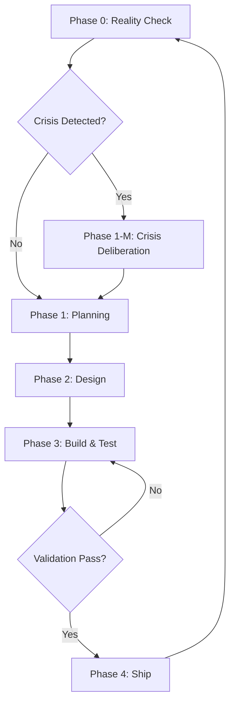

# Agentic Workflow Documentation

> **Purpose**: Comprehensive reference for maintaining and understanding the `tq` project's agentic development workflow.

## Architecture Overview

```
┌─────────────────────────────────────────────────────────────────────┐
│                         CLAUDE.md (Entry Point)                      │
│                   High-level guidance and links                      │
└───────────────────────────────┬─────────────────────────────────────┘
                                │
                                ▼
┌─────────────────────────────────────────────────────────────────────┐
│                    sprint-coordinator/SKILL.md                       │
│                  Orchestration logic for main agent                  │
└───────────────────────────────┬─────────────────────────────────────┘
                                │
                                ▼
┌─────────────────────────────────────────────────────────────────────┐
│                 sprint-coordinator/process/*.md                      │
│           Detailed step-by-step instructions per phase               │
└───────────────────────────────┬─────────────────────────────────────┘
                                │
          ┌─────────────────────┼─────────────────────┐
          ▼                     ▼                     ▼
┌─────────────────┐   ┌─────────────────┐   ┌─────────────────┐
│ cli-ux-designer │   │rust-teradata-   │   │ quality-        │
│    (Agent)      │   │architect (Agent)│   │ validator(Agent)│
└─────────────────┘   └─────────────────┘   └─────────────────┘
```

---

## The 5-Phase Workflow



### Phase Summary

| Phase | Name | Owner | Sub-Agents | Output |
|-------|------|-------|------------|--------|
| **0** | Reality Check | Coordinator | None | Sprint type decision |
| **1** | Planning | Coordinator | None | `sprint-N-planning.md` |
| **1-M** | Crisis Deliberation | Coordinator | All 3 | `sprint-N-crisis-deliberation.md` |
| **2** | Design | Coordinator | UX Designer, Architect | Updated specs + architecture |
| **3** | Build & Test | Coordinator | Architect, Validator | Code + test report |
| **4** | Ship | Coordinator | None | Git commit + review doc |

---

## Agents

### Sprint Coordinator (Main Agent)
- **File**: `.claude/skills/sprint-coordinator/SKILL.md`
- **Role**: Orchestrates the entire workflow. Makes all decisions. Validates and ships.
- **When Active**: Always (runs in main conversation loop)

### cli-ux-designer
- **File**: `.claude/agents/cli-ux-designer.md`
- **Role**: Domain expert for specifications and user experience.
- **Owns**: `docs/specifications/*.md` (feature requirements)
- **When Launched**: Phase 2 (Design), Phase 1-M (Crisis Deliberation)

### rust-teradata-architect
- **File**: `.claude/agents/rust-teradata-architect.md`
- **Role**: Domain expert for architecture and implementation.
- **Owns**: `docs/design/*.md` (technical design documentation)
- **When Launched**: Phase 2 (Design), Phase 3 (Build), Phase 1-M (Crisis Deliberation)

### quality-validator
- **File**: `.claude/agents/quality-validator.md`
- **Role**: Domain expert for testing.
- **Owns**: Test cases, test reports
- **When Launched**: Phase 3 (Test), Phase 1-M (Crisis Deliberation)

---

## Process Documents

All located in `.claude/skills/sprint-coordinator/process/`:

| Document | Purpose |
|----------|---------|
| `sprint-workflow.md` | Overview of the 5-phase workflow |
| `phase0-reality-check.md` | Review past sprints, detect patterns, decide sprint type |
| `phase1-feature-planning.md` | Create planning doc (Feature Sprint path) |
| `phase1-crisis-deliberation.md` | 2-round multi-agent discussion (Maintenance Sprint path) |
| `phase2-design.md` | Parallel specs + feasibility |
| `phase3-build-test.md` | Parallel code + tests |
| `phase4-ship.md` | Validate, commit, document |
| `definitions/done.md` | Quality checklist for shipping |

---

## Crisis Deliberation (Phase 1-M)

When Phase 0 detects a crisis (stuck issues, accumulating debt), the workflow enters a multi-agent deliberation:

```
Round 1: Coordinator → Problem Statement → All 3 Agents (Parallel)
         ↓
Synthesis 1: Coordinator merges perspectives → sprint-N-crisis-deliberation.md
         ↓
Round 2: Coordinator → Synthesis → All 3 Agents (Parallel)
         ↓
Final Decision: Coordinator creates planning doc → Proceed to Phase 2
```

### Convergence Criteria
- 2+ agents agree on root cause
- Clear priority emerges
- No blocking disagreement in Round 2

---

## Templates

Located in `.claude/templates/`:

| Template | Purpose |
|----------|---------|
| `quality-report-template.md` | Test report format with structured verdict |
| `test-case-template.md` | Individual test case format |

---

## Key Principles

1. **Coordinator is the Authority**: No supervisor. Main agent makes all decisions.
2. **Parallelism First**: Launch independent agents in one message.
3. **Read Before Act**: Always read the process doc before executing a phase.
4. **Zero Technical Debt**: Fix it now or mark it P0.
5. **100% Test Pass Rate**: Required before shipping.
6. **Reality Check First**: Every sprint starts by reviewing past performance.

---

## Skills

Skills are reusable capabilities that agents can invoke. Here's the mapping:

### Development Skills

| Skill | Used By | Purpose |
|-------|---------|---------|
| `/cli-designer` | `cli-ux-designer` | CLI design best practices (clig.dev) |
| `/rust-coder` | `rust-teradata-architect`, `quality-validator` | Idiomatic Rust code patterns |
| `/rust-debugger` | `rust-teradata-architect` | Debug Rust issues |
| `/teradata-rust` | `rust-teradata-architect` | Teradata database interactions |

### Sprint Management Skills

| Skill | Used By | Purpose |
|-------|---------|---------|
| `/sprint-coordinator` | Main Loop | Orchestrates the 5-phase workflow |
| `/sprint-reviewer` | Coordinator (Phase 4) | Generates sprint review documents |
| `/collect-metrics` | Coordinator (Phase 4) | Extracts token metrics from transcripts |
| `/optimize-agents` | Coordinator (after 2+ sprints) | Analyzes metrics for optimizations |

### Framework Development Skills

| Skill | Used By | Purpose |
|-------|---------|---------|
| `/skill-builder` | Main Loop (on demand) | Create new skills |
| `/subagent-builder` | Main Loop (on demand) | Create new sub-agents |

---

## Directory Structure

```
.claude/
├── agents/
│   ├── cli-ux-designer.md
│   ├── rust-teradata-architect.md
│   └── quality-validator.md
├── skills/
│   └── sprint-coordinator/
│       ├── SKILL.md
│       └── process/
│           ├── sprint-workflow.md
│           ├── phase0-reality-check.md
│           ├── phase1-feature-planning.md
│           ├── phase1-crisis-deliberation.md
│           ├── phase2-design.md
│           ├── phase3-build-test.md
│           ├── phase4-ship.md
│           └── definitions/
│               └── done.md
├── templates/
│   ├── quality-report-template.md
│   └── test-case-template.md
├── scripts/
│   └── validate-framework.sh
└── blockers/
    └── (documented blockers)
```

---

## Validation

Run the framework validation script to check integrity:

```bash
bash .claude/scripts/validate-framework.sh
```

Checks:
- All process documents exist
- All templates exist
- Agent versioning present
- No broken links (basic)

---

## Escalation

If any agent encounters an unresolvable blocker:
1. Document in `.claude/blockers/YYYYMMDD-description.md`
2. Stop workflow
3. User provides guidance
