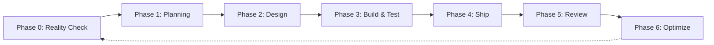

# Sprint-Driven Development Workflow

This document provides an overview of the 7-phase workflow for developing the `tq` project.

## Workflow Diagram

## Phase Summary

| Phase | Name | Goal | Sub-Agents |
|-------|------|------|------------|
| **0** | [Reality Check](phase0-reality-check.md) | Reflect on past sprints. Decide: Feature or Maintenance Sprint. | None |
| **1** | [Planning](phase1-feature-planning.md) | (Feature) Define objectives, scope, and acceptance criteria. | None |
| **1-M** | [Crisis Deliberation](phase1-maintainance-planning.md) | (Maintenance) Multi-agent discussion to reach consensus on crisis resolution. | All 3 agents |
| **2** | [Design](phase2-design.md) | Create detailed specifications and assess feasibility. | `cli-ux-designer`, `rust-teradata-architect` |
| **3** | [Build & Test](phase3-build-test.md) | Implement features and validate with tests. | `rust-teradata-architect`, `quality-validator` |
| **4** | [Ship](phase4-ship.md) | Validate, commit, document, and release. | None |
| **5** | [Retrospective](phase5-review.md) | Sprint retrospective. | None |
| **6** | [Optimization](phase6-optimize.md) | Agentic framework optimisation. | None |

## Key Principles

### 1. Parallelism First
Launch independent agents in a **single message with multiple Task calls**.
- **Design Phase**: UX + Architecture in parallel.
- **Build & Test Phase**: Coding + Testing in parallel.

### 2. Coordinator is the Authority
The Sprint Coordinator (main agent) makes all decisions. Sub-agents are specialists who execute specific tasks and return results.

### 3. Quality Standards
- **Zero Technical Debt**: Fix it now, or mark it P0 for next sprint.
- **100% Test Pass Rate**: Required before shipping.
- **Docs Match Code**: If they diverge, the code is wrong.

### 4. Agent Roles
| Agent | Responsibility |
|-------|----------------|
| **Sprint Coordinator** | Orchestrates workflow, validates, ships. |
| `cli-ux-designer` | Owns specifications and UX. |
| `rust-teradata-architect` | Owns architecture and implementation. |
| `quality-validator` | Owns test design and execution. |
