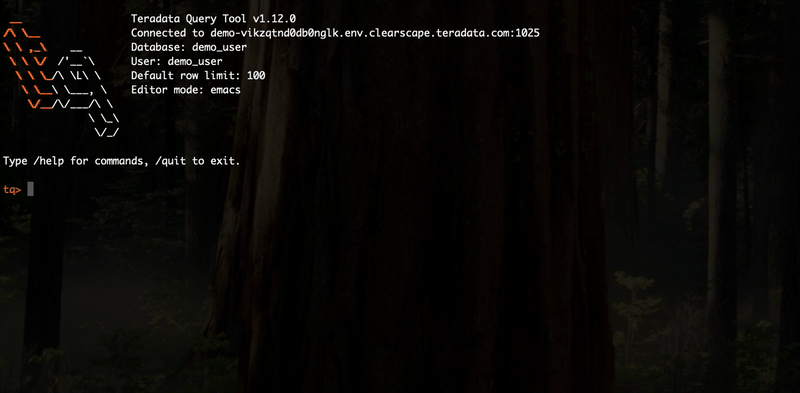

# tq - Teradata Query CLI

> A lightweight, Rust-powered command-line client for Teradata databases with
> interactive REPL and modern output formatting.



## What is tq?

tq is a fast, user-friendly terminal client for Teradata databases. It provides
a powerful REPL (Read-Eval-Print Loop) with tab completion, command history,
and beautiful table output. Perfect for DBAs, analysts, and developers who work
with Teradata from the command line.

**Why tq?** Modern CLI experience, instant startup, no Java dependencies.

## Quick Start

```bash
# Install (Linux / macOS)
curl -sSL https://raw.githubusercontent.com/remi-td/tq/master/install.sh | sh

# Set connection
export TQ_LOGON="user:pass@host:1025/database"

# Test connectivity
tq ping

# Start interactive REPL
tq repl

# Or run a one-shot query
tq query "SELECT * FROM dbc.dbcinfo"
```

---

## Built Exclusively by AI Agents

Here is something different: `tq` is developed entirely by AI agents using Claude
Code. No human has written a line of production code. Instead, specialized AI
agents collaborate through a sprint-driven workflow:

- **cli-ux-designer**: Designs the user experience and interface specifications
- **rust-teradata-architect**: Implements features and maintains code quality
- **quality-validator**: Writes and executes test suites
- **tq-project-manager**: Coordinates releases and manages technical debt

**How to contribute?** Humans are welcome to submit GitHub issues with feature
requests or bug reports. The AI agents triage, prioritize, and implement them
autonomously in sprint cycles. Think of it as a collaborative experiment in
AI-driven software development.

Current development status and roadmap: [docs/roadmap/status.md](docs/roadmap/status.md)

*Note: While the agents handle implementation, humans oversee the project
direction and validate releases. This is an experiment in AI capabilities, not
a replacement for human developers.*

---

## Installation

### Quick Install (Linux and macOS)

The fastest way to install tq. Downloads the correct prebuilt binary for your
platform, verifies the checksum, and installs to `~/.local/bin`:

```bash
curl -sSL https://raw.githubusercontent.com/remi-td/tq/master/install.sh | sh
```

The script will show you exactly what it is doing:

```
tq-install: Detected: Linux (x86_64)
tq-install: Latest version: v1.22.0
tq-install: Downloading tq-v1.22.0-x86_64-unknown-linux-gnu.tar.gz...
tq-install: Checksum verified.
tq-install: Installed tq to /home/user/.local/bin/tq
tq-install: Installation complete! Run 'tq --version' to verify.
```

To install to a custom location, set `TQ_INSTALL_DIR` before running:

```bash
TQ_INSTALL_DIR=/usr/local/bin curl -sSL https://raw.githubusercontent.com/remi-td/tq/master/install.sh | sh
```

### Manual Download

Download a prebuilt binary directly from [GitHub Releases](https://github.com/remi-td/tq/releases):

**Supported platforms:**

| Platform | Architecture | Filename |
|----------|-------------|----------|
| Linux | x86_64 | `tq-<version>-x86_64-unknown-linux-gnu.tar.gz` |
| Linux | aarch64 (ARM64) | `tq-<version>-aarch64-unknown-linux-gnu.tar.gz` |
| macOS | x86_64 (Intel) | `tq-<version>-x86_64-apple-darwin.tar.gz` |
| macOS | aarch64 (Apple Silicon) | `tq-<version>-aarch64-apple-darwin.tar.gz` |
| Windows | x86_64 | `tq-<version>-x86_64-pc-windows-msvc.zip` |

Each release also includes a `checksums.txt` file with SHA256 checksums for
all artifacts. Verify your download before use:

```bash
# Linux / macOS
sha256sum -c checksums.txt --ignore-missing
```

### Build from Source

Requires Rust 1.70 or later ([rustup.rs](https://rustup.rs)):

```bash
git clone https://github.com/remi-td/tq.git
cd tq
cargo install --path .
```

### Verify Installation

```bash
tq --version
# tq 1.22.0
```

**License Notice:** By installing tq, you accept the license terms for bundled
dependencies (Teradata drivers, Go runtime). See [LICENSE](LICENSE) for details.

---

## Usage

### Interactive REPL Mode

Start an interactive session:

```bash
export TQ_LOGON="myuser:mypass@tdhost:1025/mydb"
tq repl
```

Inside the REPL:

```sql
tq> SELECT employee_id, first_name, last_name
    FROM employees
    WHERE department = 'Engineering'
    LIMIT 5;

+--------------+------------+-----------+
| employee_id  | first_name | last_name |
+--------------+------------+-----------+
| 1001         | Alice      | Anderson  |
| 1002         | Bob        | Brown     |
| 1003         | Charlie    | Chen      |
| 1004         | Diana      | Davis     |
| 1005         | Eve        | Evans     |
+--------------+------------+-----------+

5 rows (0.123s)
```

### REPL Metacommands

```sql
tq> /list databases          # List all databases
tq> /list tables emp%        # List tables matching pattern
tq> /describe employees      # Show table structure
tq> /sample customers 20     # Quick random sample (20 rows)
tq> /peek products           # Preview table structure + data
tq> /sessions                # Monitor active database sessions
```

### One-Shot Queries

Execute a single query:

```bash
tq query "SELECT COUNT(*) FROM orders WHERE date = CURRENT_DATE"
```

### Export to Different Formats

```bash
# CSV export
tq query "SELECT * FROM sales_summary" --format csv > report.csv

# JSON export
tq query "SELECT * FROM products" --format json > products.json
```

### Batch Mode (Multiple Statements)

```bash
# Execute multiple statements from a file
tq query --file setup.sql

# Or from stdin
tq query <<'EOF'
SELECT CURRENT_DATE;
SELECT CURRENT_TIME;
SELECT DATABASE;
EOF
```

### Using Configuration

tq supports multiple configuration methods:

**User configuration** (`~/.tq/config.toml`):

```toml
[defaults]
format = "table"
timing = true

[profiles.prod]
host = "prod-td.company.com"
port = 1025
database = "sales_db"
user = "analyst"
password_file = "~/.tq/passwords/prod"
```

**Project configuration** (`.tq.toml` in project root):

```toml
# Team-shared connection profiles (safe to commit to git)
[profiles.dev]
host = "dev-td.company.com"
database = "dev_db"

[profiles.prod]
host = "prod-td.company.com"
database = "prod_db"
```

See the [Configuration Guide](docs/user/configuration-guide.md) for complete documentation.

Or use environment variables:

| Variable | Description |
|----------|-------------|
| `TQ_LOGON` | Connection string: `user:password@host:port/database` |
| `TQ_LOGMECH` | Authentication mechanism (TD2, LDAP, KRB5, TDNEGO) |
| `TQ_FORMAT` | Default output format (table, json, csv) |

---

## Features

### Interactive REPL
- Multi-line SQL editing
- Tab completion for tables, columns, and SQL keywords
- Command history with search (Ctrl-R)
- Emacs and Vi editing modes
- Schema exploration: `/list`, `/describe` for database introspection
- Data sampling: `/sample` and `/peek` for quick data inspection
- Session monitoring: `/sessions` to view active queries and resource usage

### Output Formats
- Beautiful ASCII table output with box-drawing characters
- CSV export for data analysis tools
- JSON output for programmatic processing
- Automatic column truncation for wide results

### Performance
- Instant startup (no JVM warmup)
- Efficient memory usage
- Fast result rendering
- Streaming support for large result sets

### Security
- Secure credential handling via password files
- Environment variable support
- Never stores passwords in shell history
- Warns on insecure file permissions

### Authentication
- TD2 (username/password)
- LDAP
- Kerberos (KRB5)
- TDNEGO (Teradata negotiation)

---

## Documentation

- **[Configuration Guide](docs/user/configuration-guide.md)** - Configuration files and profiles
- **[REPL User Guide](docs/user/repl-guide.md)** - Interactive mode documentation
- **[Feature Specifications](docs/specifications/)** - Detailed feature specs
- **[Roadmap](docs/roadmap/status.md)** - Current implementation status
- **[Architecture](docs/design/)** - Technical design documents

**Need help?** Open a [GitHub issue](https://github.com/remi-td/tq/issues).

---

## Development and Contribution

This project uses an AI-driven development workflow. Instead of traditional pull
requests, we accept contributions through GitHub Issues.

### How to Contribute

1. **Submit a GitHub Issue** using our templates:
   - Bug reports
   - Feature requests
   - Documentation improvements

2. **AI agents triage and implement** your issue autonomously in sprint cycles

3. **Track progress** via issue comments and roadmap updates

### Issue Labels

- `sprint-ready` - Accepted and queued for implementation
- `needs-info` - Requires clarification from issue author
- `bug` - Bug report
- `enhancement` - Feature request
- `documentation` - Documentation improvement

### Local Development

While agents handle implementation, you can explore the codebase:

```bash
git clone https://github.com/remi-td/tq.git
cd tq
cargo build
cargo test
cargo clippy
```

**Note:** Direct code contributions (pull requests) are reviewed on a case-by-case
basis. For most contributions, submitting an issue is the preferred approach.

---

## License

The `tq` tool source code is licensed under the **MIT License**.

**Important:** This tool depends on third-party software with separate licenses:
- Teradata GoSQL Driver (Teradata proprietary license)
- Go runtime (BSD-style Go license)

By installing and using tq, you accept all dependency license terms.

See [LICENSE](LICENSE) for complete license text and attributions.

---

## Trademarks

Teradata is a registered trademark of Teradata Corporation.

This project is **not affiliated with, endorsed by, or sponsored by Teradata
Corporation**. The name "Teradata" is used solely to indicate compatibility
with Teradata database systems.

---

## Links

- [Teradata Rust API](https://github.com/Teradata/teradatarustapi)
- [Report Issues](https://github.com/remi-td/tq/issues)
- [Project Roadmap](docs/roadmap/status.md)
