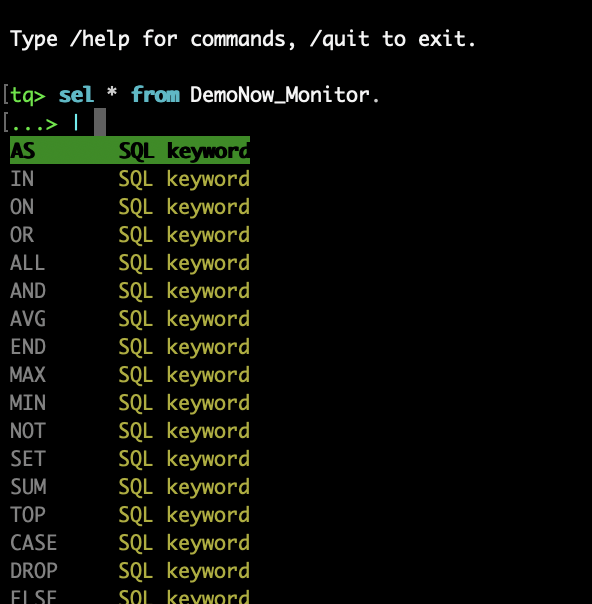

# Current bug and urgent issues

Created on 2026-01-18 at 20:15

## Logo and branding

The last two lines are offset, so the logo doesn't render properly!

```
  _____
 |_   _|__ _
   | |/ _` |
   | | (_| |
   |_|\__, |   Teradata Query Tool
      |_|     v1.6.1
```



You missed your own branding guidelines: `tq` should be written in lowercase with th 't' in the Teradata orabge color (#F37021). Also use the block character: █ it would be easier than the | and _...

I would also use the same teradata orange as default for the interactive prompt color: `tq>` (currently green).

## Tab Completion STTILL DOESN'T WORK PROPERLY

This is the third sprint where you failed to implement tab completion properly.


This does't work on special words either. eg. `sel * fr`+tab gives me all possible reserved words! (obviously this should automatically complete with `FROM` as this is the only possible word).
eg. tab after
  `select * from ` gives keywords when it should be databasenames, selecting a keyword inserts it at the beginning of the
  current line instead of where my cursor ar at, etc... These were right a few sprint ago!

This has exactly the same issue as last sprint, and the two before that...

## Export needs enhancements
Two key enhancements that I need you to prioritize:
- This is confusing:
```
tq> /export
Usage: /export <format> [file]
       /export <format> clipboard
       /export clipboard [format]
       /export <format> --append [file]

Formats: table (default), csv, json, sql
Examples:
  /export csv results.csv
  /export clipboard csv
  /export json clipboard
  ```
  and from /help: 
  ```
    /export <fmt> [file]   Export last result (table, csv, json, sql)
    /export clipboard      Copy last result to clipboard
```

Make it simply /export <format> [file|clipboard] so semantics are clear!

- THIS STILL DOESN'T WORK PROPERLY: Export should allow to export ALL the dataset to a file: if I do a `select * from mytable;` you will limit the dataset to 100 (or the default) rows, which makes sense since we don't want to display all in the terminal not to pointlessly export all from the database. However, if I want to export to a file, I want to export ALL the dataset, not just the first 100 rows... Of course, if it's my who specified a limit (eg. `select top 1000 * from mytable;`), then it will export the 1000 rows to the file (this currently works fine). So what you need to so is just to make sure we export the full dataset when no limit is specified by the user.
