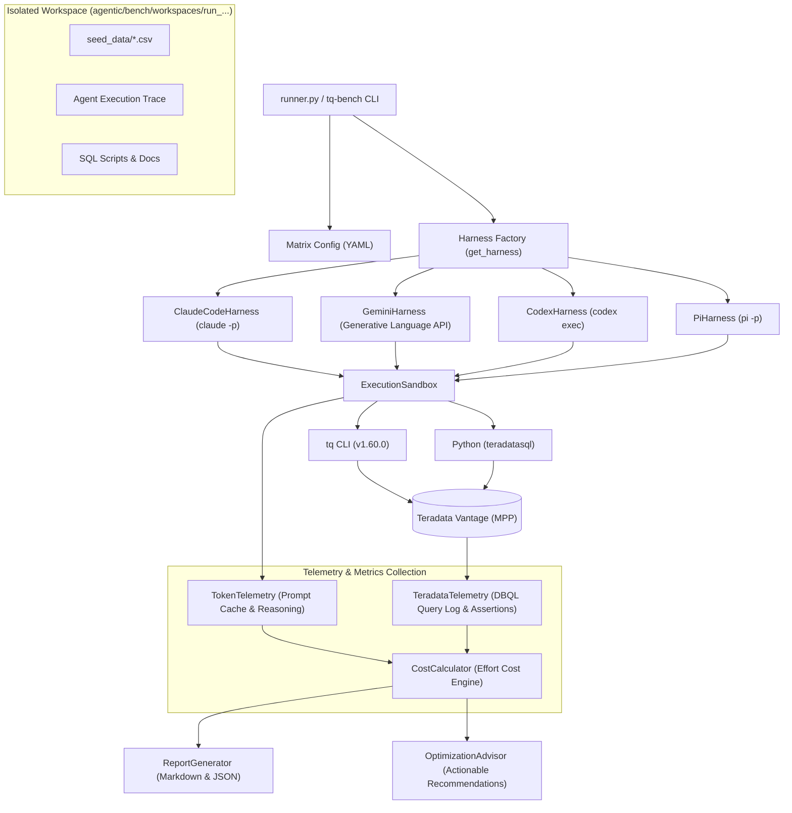

# Technical Design: Agentic Optimization & Evaluation Framework

This document outlines the technical architecture, component design, telemetry pipelines, and recommendation heuristics for the `tq` Agentic Optimization & Evaluation Framework (`agentic/bench`).

---

## 1. Architectural Overview

The framework provides an automated, reproducible test harness that runs autonomous AI coding agents across various models and CLI harnesses against live analytical database systems.



---

## 2. Component Architecture

### 2.1 Workspace Isolation & Safety Model

Each benchmark scenario executes in a dedicated, ephemeral workspace directory under `agentic/bench/workspaces/run_<prefix>_<model>/`.
1. **Source Seed Ingestion**: Source CSV files are copied from `agentic/bench/datasets/<dataset>/seed_data/` into the sandbox.
2. **Table Prefix Namespacing**: Every run receives an isolated table prefix (e.g., `b_84097_co_`). Staging, dimension, and fact tables are created exclusively under this namespace, guaranteeing zero interference between concurrent runs.
3. **Environment Filtering**:
   - In `baseline-python` mode, the `PATH` environment variable is sanitized to remove directories containing the `tq` binary, and `TQ_LOGON` is cleared, ensuring the agent must write native Python code.
   - In `tq-with-skill` mode, the sanitized `teradata-query` skill instructions are supplied either via `--skill`, `--append-system-prompt-file`, or system prompts.
4. **Post-Run Cleanup**: After telemetry collection and assertion verification, `TeradataTelemetry.cleanup_benchmark_objects(table_prefix)` executes `DROP TABLE` and `DROP VIEW` commands for all generated database objects.

---

## 3. Multi-Harness Abstraction Layer

All harnesses inherit from the abstract base class `AgentHarness` (`agentic/bench/harness/base.py`):

```python
class AgentHarness(ABC):
    def __init__(self, model_id: str, mode: str, workspace_dir: Path):
        self.model_id = model_id
        self.mode = mode
        self.workspace_dir = workspace_dir
        self.db_telemetry = TeradataTelemetry()
        self.cost_calculator = CostCalculator()

    @abstractmethod
    def execute(
        self,
        task_prompt: str,
        table_prefix: str,
        validation_spec: dict[str, Any],
        timeout_seconds: int = 300
    ) -> RunResult:
        ...
```

### 3.1 Supported Agent Adapters

1. **Claude Code (`ClaudeCodeHarness`)**:
   - Spawns headless `claude -p` subprocess.
   - Passes `--output-format json`, `--dangerously-skip-permissions`, and appends system prompt files.
   - Extracts token usage, prompt cache creation/read tokens, reasoning tokens, and execution traces from the top-level JSON response.
2. **Google Gemini (`GeminiHarness`)**:
   - Interacts with Google Generative Language API via the OpenAI-compatible SDK endpoint.
   - Implements a deterministic multi-turn tool execution loop exposing the `execute_command` bash tool.
   - Captures per-turn tool calls, command outputs, prompt tokens, cached prompt tokens, and completion tokens.
3. **OpenAI Codex (`CodexHarness`)**:
   - Spawns `codex exec` with `--json`, `--ephemeral`, and `--ignore-user-config`.
   - Bypasses interactive approvals via `--dangerously-bypass-approvals-and-sandbox`.
   - Parses the JSON event stream (`turn.completed`, `item.created`) to extract token usage and tool call sequences.
4. **Pi Agent (`PiHarness`)**:
   - Spawns `@earendil-works/pi-coding-agent` via `pi -p` non-interactive execution.
   - Uses `--approve`, `--no-context-files`, and `--session-dir` to store session traces.
   - Parses the session JSONL file to extract per-turn tool calls (`bash`), execution timings, and exact token telemetry (`input`, `output`, `cacheRead`, `cacheWrite`, `reasoning`).

---

## 4. Telemetry & Effort Cost Engine

### 4.1 Token Accounting & Prompt Caching Dynamics

Multi-turn coding agents send expanding conversation histories back to the LLM at each turn. Counting raw tokens cumulatively severely distorts cost calculations. The framework accounts for modern KV prompt cache economics:

$$\text{Token Cost} = \sum_{t=1}^{T} \left( \frac{I_t \cdot R_{\text{in}}}{10^6} + \frac{O_t \cdot R_{\text{out}}}{10^6} + \frac{C_{r,t} \cdot R_{\text{cache\_read}}}{10^6} + \frac{C_{w,t} \cdot R_{\text{cache\_write}}}{10^6} \right)$$

Where:
- $I_t$: Uncached prompt input tokens on turn $t$.
- $O_t$: Generated output (and reasoning) tokens on turn $t$.
- $C_{r,t}$: Prompt cache hit tokens on turn $t$ (discounted by up to 90% by Anthropic, OpenAI, and Google).
- $C_{w,t}$: Ephemeral cache creation tokens on turn $t$.

### 4.2 Teradata DBQL Telemetry Pipeline

Rather than relying on client-side timers, the framework interfaces directly with the Teradata Database Query Log (DBQL):

1. **Start Timestamp**: Prior to agent invocation, `record_start_timestamp()` fetches server-side `CURRENT_TIMESTAMP`.
2. **Buffer Flush**: Upon agent termination, the framework issues `FLUSH QUERY LOGGING WITH ALL;` to force in-memory AMP buffers to flush into catalog views.
3. **Metrics Extraction**: Queries `DBC.QryLogV` filtered by execution time span and username:
   - `total_cpu`: Total AMP CPU time in seconds.
   - `total_io`: Total physical and cached I/O count.
   - `peak_spool`: Maximum spool bytes consumed.
   - `avg_cpu_skew_pct`: Percentage skew between max AMP CPU and average AMP CPU.
   - `avg_io_skew_pct`: Percentage skew between max AMP I/O and average AMP I/O.

---

## 5. Automated Optimization Advisor (`OptimizationAdvisor`)

The advisor scans execution traces and telemetric indicators to generate targeted recommendations across four categories:

1. **Token Compression**:
   - *Heuristic*: Agent queries large analytical tables without `--format toon`, `--agent`, or `--budget`.
   - *Action*: Recommend enabling token compression flags or defaulting `tq` to compact JSON on non-TTY streams.
2. **Catalog Discovery Optimization**:
   - *Heuristic*: Agent executes raw SQL queries against `DBC.Tables` or `DBC.Columns`.
   - *Action*: Strengthen companion skill to mandate `tq schema` or `tq inspect` commands.
3. **Primary Index & Skew Detection**:
   - *Heuristic*: Created tables exhibit $>25\%$ AMP CPU or I/O skew.
   - *Action*: Suggest high-cardinality Primary Index columns matching downstream join foreign keys.
4. **Resilience & Transaction Management**:
   - *Heuristic*: Agent encounters Teradata Error 3932 (DDL/DML mixing in transactions) or retry loops.
   - *Action*: Recommend sequential auto-commit execution or warning-level downgrade flags (`--errorlevel 3807 warning`).
